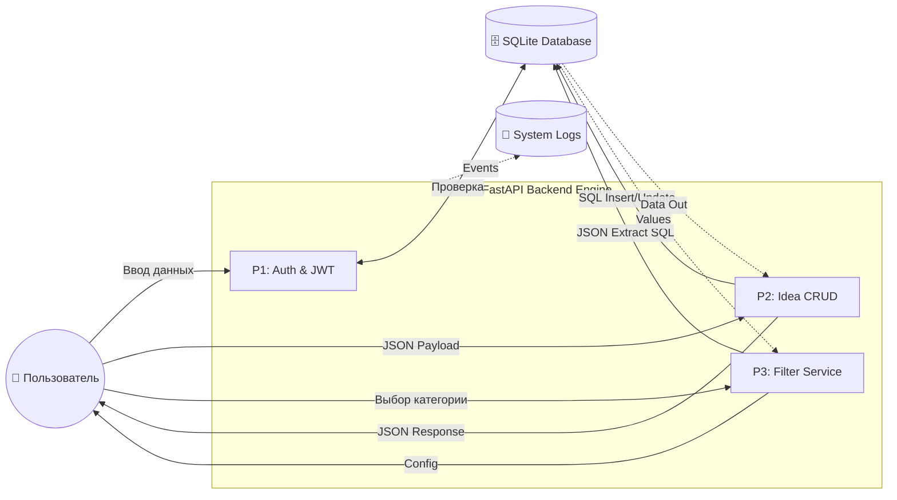

# 🔄 Диаграмма потоков данных (Data Flow Diagram)

---

## 📊 DFD Level 1: Архитектура процессов

Данная диаграмма показывает, как процессы (обработка) взаимодействуют с внешними сущностями (пользователь) и хранилищами данных.

## 📊 DFD Level 1: Архитектура процессов

---

## 🛠 Детальное описание потоков (Data Flow Map)

| ID | Поток | Источник | Приемник | Описание |
| :--- | :--- | :--- | :--- | :--- |
| **1** | **Credentials** | Пользователь | P1 (Auth) | Передача `username` и `password`. |
| **2** | **JWT Flow** | P1 (Auth) | Пользователь | Возврат токена после успешной сверки хеша пароля (bcrypt). |
| **3** | **JSON Payload** | Пользователь | P2 (CRUD) | Объект идеи с вложенным словарем `attributes` произвольной структуры. |
| **4** | **JSON Storage** | P2 (CRUD) | DB | Трансформация Python-словаря в строку JSON для записи в колонку `attributes`. |
| **5** | **Filter Logic** | P3 (Filters) | User | Динамический набор фильтров, сформированный на основе имеющихся в базе данных. |

---

## 🧠 Ключевые аналитические наблюдения

### 1. Гибкая схема данных (EAV / JSON)
В процессе **P2** реализована «бессхемная» модель данных. Бэкенд не валидирует структуру вложенных атрибутов идей, что позволяет добавлять новые типы полей (срок реализации, бюджет, язык программирования) через интерфейс категорий без изменения структуры SQL-таблиц.

### 2. Динамическая аналитика (Late Binding)
Процесс **P3** демонстрирует метод **Late Binding**. Система не знает заранее, какие значения фильтров будут доступны. Она выполняет SQL-запрос с функцией `json_extract` в реальном времени, анализируя текущее содержимое базы. Это гарантирует пользователю отсутствие пустых выборок.

---