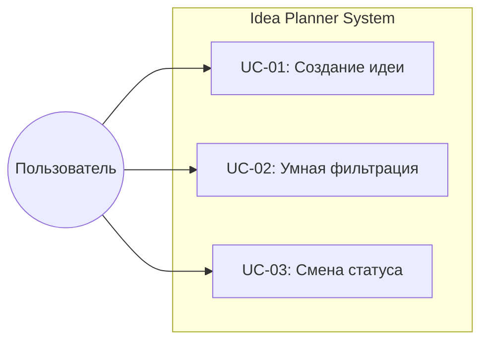
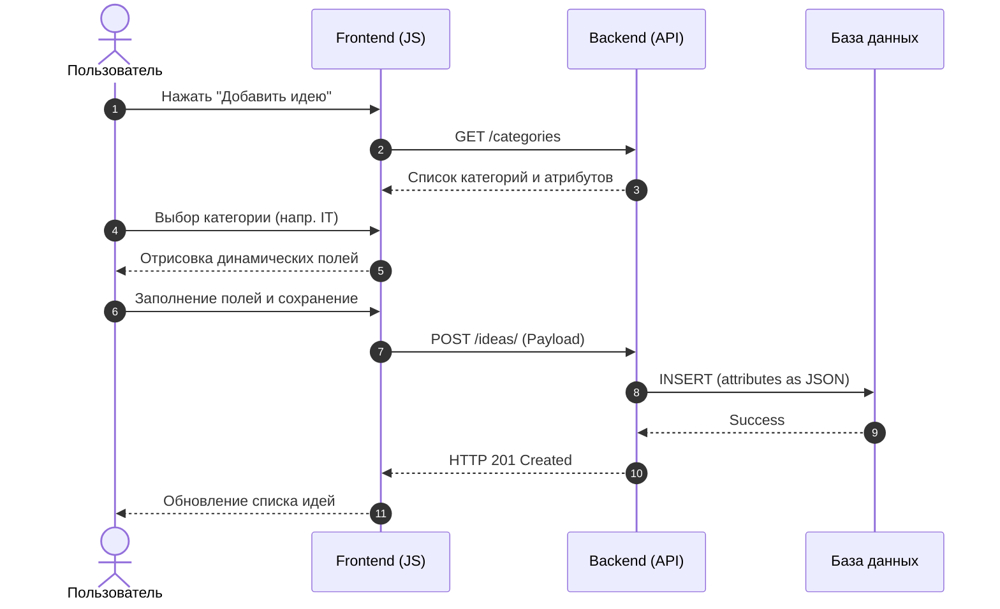
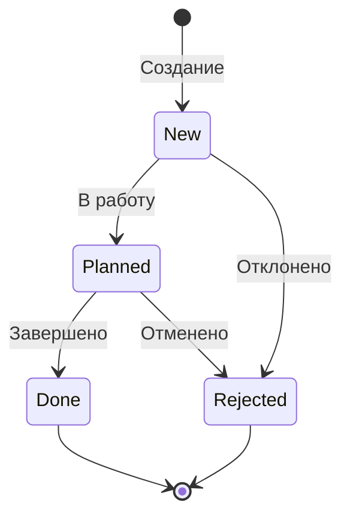

# 👥 Пользовательские сценарии (Use Cases)

## 🎭 Роли (Акторы)

| Роль | Описание |
| :--- | :--- |
| **Пользователь** | Авторизованный участник системы. Может создавать, просматривать и редактировать идеи. |
| **Система (API)** | Серверная часть на FastAPI, обеспечивающая валидацию данных и работу с БД. |

---

## 🗺️ Карта сценариев (Use Case Diagram)



---

## 📝 UC-01: Создание идеи с динамическими атрибутами

> [!IMPORTANT]
> **Бизнес-ценность:** Позволяет пользователям описывать идеи разных категорий с индивидуальным набором полей через JSON-колонку без изменения схемы БД.

### 📊 Диаграмма взаимодействия (Sequence Diagram)



### 🟢 Основной сценарий
1. Пользователь инициирует создание новой идеи.
2. Фронтенд запрашивает список категорий и привязанных к ним атрибутов (`linked_attributes`).
3. Пользователь выбирает категорию из списка.
4. Система динамически отрисовывает поля ввода (текст, селекторы, даты) на основе настроек категории.
5. Пользователь заполняет данные и нажимает кнопку "Сохранить".
6. Бэкенд валидирует входящий JSON, упаковывает динамические поля в колонку `attributes` и сохраняет запись.

<details>
<summary><b>💻 Пример передаваемого JSON (нажми, чтобы развернуть)</b></summary>

```json
{
  "title": "Интеграция с ИИ",
  "category_id": 1,
  "attributes": {
    "language": "Python",
    "priority": "High",
    "complexity": "Hard"
  }
}
```
</details>

---

## 🔍 UC-02: Использование умных фильтров

**Описание:** Система анализирует существующие идеи и предлагает фильтры только по тем значениям, которые реально присутствуют в базе.

### 🟢 Основной сценарий
1. Пользователь выбирает категорию в панели фильтров.
2. Система выполняет запрос `GET /categories/{id}/filters`.
3. **Бизнес-логика:** Бэкенд через `json_extract` собирает уникальные значения атрибутов из всех идей данной категории.
4. Пользователь видит актуальные фильтры и применяет их.

> [!TIP]
> Это избавляет пользователя от фильтрации по пустым значениям.

---

## 🔄 UC-03: Продвижение идеи по жизненному циклу

**Описание:** Изменение текущего состояния идеи (статуса).

### 📊 Диаграмма состояний (State Diagram)



### 🟢 Основной сценарий
1. Пользователь выбирает новый статус в карточке идеи.
2. Система отправляет запрос `PATCH /ideas/{id}/status`.
3. Бэкенд обновляет статус и фиксирует время изменения в `updated_at`.
4. Карточка идеи мгновенно меняет цвет/метку в интерфейсе.

> [!WARNING]
> Если идея была удалена в другой сессии, система вернет ошибку 404.